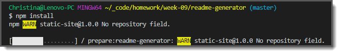
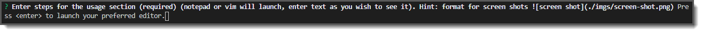
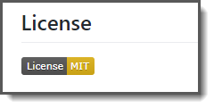
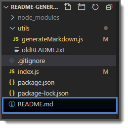

# Good README.md Generator 

### Unit 09 Node.js and ES6+ Homework: Good README Generator 

## Description 

A good readme.md file is key to a good project on your GitHub repository. It gives people an initial overview of your project as well as how to access it, use it, and any other pertinent information that you provide. README files are separated into sections and can include a Table of Contents for visitors to quickly access the different sections of your readme at the click of a button. 

This readme generator will prompt you with questions, thus guiding you through easily creating your readme file for your project. It is run using node.js with inquirer. 

## Table of Contents 

* [Installation](#installation)
* [Usage](#usage)
* [License](#license)

## Installation 

Using GitHub, clone or fork the repository. You'll need to get the repo pulled to your local repository. Once you have the repo locally, be sure to run npm install from your terminal to install inquirer and all other dependencies for the application. 

 

If you plan to push the repo back to your GitHub repo, be sure to add a .gitignore file to your root folder and ignore node_modules and .DS_Store/ . 

## Usage

Make sure you are in the root folder of the project in your terminal and type node index.js.

As you are prompted, answer the questions and hit enter. 

The Project Title and Usage answers are required as noted in the prompt. The Usage section will launch notepad or vim (or your default text editor), which gives you the ability to enter multiple lines of text with carriage returns that will appear exactly as you type it when the README is generated. You can also include references to images to include screen shots.

Once you are done entering text in the editor, save and close the text editor to add your typed text.

If there are questions that you don't want included in the README file, simply leave the answer blank and press enter.  For example, if you didn't have any collaborators then there would be no need to enter information for that section.

For the license section, you can choose from a list of pre-determined licenses. Selecting the license(s) from the list will then show the license badge, with a link, in your README. (as shown, use the space bar to select (a) license(s))

The last question will ask you to hit Enter to create the generate the README.md file. After hitting enter, you will see the README.md file in your root folder of the project.

Push your project to GitHub to view the README.md file with all of the formatting and to test the TOC.

 

## License 

